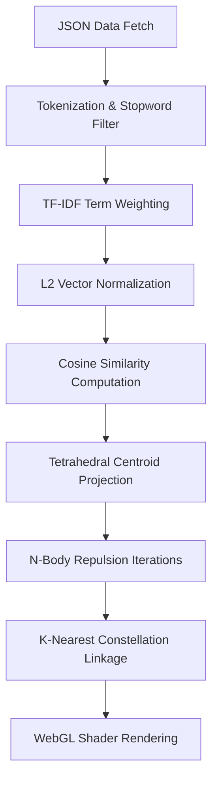

# 3D Semantic Galaxy & Embeddings Representation Engine

This repository features an interactive, semantically grounded **3D Constellation Galaxy** that models and visualizes the relationships between 21 projects and 6 professional experiences. 

Rather than using manual coordinate assignments or heavy pre-trained models, the layout is computed entirely on-device inside WebGL using a self-contained **Vector Space Model (VSM)**.

---

## 🚀 Key Architectural Pipeline

---

## 1. Document Tokenization & Preprocessing
When the portfolio loads, all document details (titles, descriptions, challenges, results, and technologies) are processed to extract semantic keywords.
- **Normalization:** Text is forced to lowercase and stripped of non-alphanumeric characters.
- **Stopwords Filtration:** Common English stopwords (e.g., *the, and, for, with, about*) are removed using a local HashSet to prevent high-frequency noise from dominating vector weights.
- **Word Extraction:** The remaining tokens form the vocabulary of the document:
  $$\mathbf{D}_i = \{ t_1, t_2, \dots, t_k \}$$

---

## 2. Dynamic TF-IDF Term Weighting
Each document $d$ in the corpus is represented as a high-dimensional vector in a global vocabulary space. The weight $W_{t,d}$ of term $t$ in document $d$ is computed using **Term Frequency-Inverse Document Frequency (TF-IDF)**:

### A. Term Frequency ($TF$)
Measures the local frequency of term $t$ in the document $d$:
$$TF_{t,d} = \text{Count of } t \text{ in } d$$

### B. Inverse Document Frequency ($IDF$)
Calculates the global importance of term $t$ across the corpus of size $N$ (where $N = 27$):
$$IDF_t = \ln\left(1 + \frac{N}{DF_t}\right)$$
*where $DF_t$ is the Document Frequency—the number of documents containing term $t$. Terms that appear in almost all documents (e.g., "code", "software") are heavily penalized, while specific terms (e.g., "CRDT", "WebGPU", "TensorFlow") receive high weights.*

### C. L2 Vector Normalization
To prevent longer documents (which naturally have higher term counts) from dominating similarity measurements, every TF-IDF document vector is normalized to unit length (L2 norm):
$$\mathbf{V}_d = \frac{\mathbf{W}_d}{\|\mathbf{W}_d\|_2} = \frac{\mathbf{W}_d}{\sqrt{\sum_{t} W_{t,d}^2}}$$

---

## 3. Cosine Similarity Space Projection
The semantic relationship between any two items (e.g., project-to-project or project-to-experience) is defined as the cosine of the angle between their L2-normalized vectors (which simplifies to their dot product):
$$\text{Similarity}(\mathbf{A}, \mathbf{B}) = \cos(\theta) = \frac{\mathbf{A} \cdot \mathbf{B}}{\|\mathbf{A}\|_2 \|\mathbf{B}\|_2} = \sum_{t} A_t B_t$$

### A. Cluster Centroids
Four primary category anchors (vertices) are established in the 3D space:
1. **AI/ML & LLM** (Vertex: `[x: 8.0, y: 4.0, z: 0.0]`)
2. **Computer Vision & 3D** (Vertex: `[x: -8.0, y: 4.0, z: -4.0]`)
3. **Systems & Cyber Security** (Vertex: `[x: -8.0, y: -4.0, z: 4.0]`)
4. **Tools & Simulation** (Vertex: `[x: 8.0, y: -4.0, z: -4.0]`)

Each category vertex is assigned a predefined centroid vector constructed from domain keywords (e.g., AI/ML uses *nlp, llm, pytorch, training, model, weights*).

### B. Mathematical Placement
For each node, we calculate the similarity $s_c$ to each category centroid $c$:
1. **Power Scaling:** Similarities are power-scaled ($w_c = s_c^{3.0}$) to amplify strong affinities and reduce background noise.
2. **Project Anchoring:** Projects are positioned inside their primary category sector. Their distance from the center is proportional to their category confidence, and they are offset slightly by their minor category similarities.
3. **Dynamic Experience Positioning:** Professional experiences are positioned **100% dynamically** using center-of-mass vector interpolation. The coordinates $\mathbf{X}_{\text{node}}$ are the weighted average of the category vertices:
   $$\mathbf{X}_{\text{node}} = \frac{\sum_c w_c \mathbf{X}_c}{\sum_c w_c}$$
   *If an experience (like Ho's Google AI Edge role) bridges both "AI/ML" and "Systems", the math draws it directly into the space between those vertices, representing its multidisciplinary nature.*

---

## 4. N-Body Repulsion Layout (Collision Prevention)
To resolve visual overlapping in dense clusters, an N-body repulsion layout pass is executed before WebGL rendering.
- For 20 iterations, every node checks its distance to every other node.
- If the center-to-center distance $d$ between Node $i$ and Node $j$ is less than $2.4$ units, a repulsive force is applied symmetrically:
  $$\mathbf{F}_{\text{rep}} = 0.25 \times (2.4 - d) \times \frac{\mathbf{X}_i - \mathbf{X}_j}{\|\mathbf{X}_i - \mathbf{X}_j\|}$$
- Nodes slide apart until the layout settles, ensuring high readability and clean click targeting while preserving semantic clusters.

---

## 5. Fully Connected K-Nearest Constellation
To form the beautiful constellation web, connection lines are dynamically drawn:
- **Guaranteed Connectivity:** To prevent isolated nodes, every node is guaranteed a connection to its absolute closest semantic peer (the document with the highest cosine similarity).
- **Secondary Webbing:** Nodes are also connected to their 2nd and 3rd nearest semantic neighbors if their spatial distance in WebGL units is within $11.5$ units.
- **Visual Blending:** The connection lines are drawn using a custom cylinder mesh with `THREE.AdditiveBlending` and self-illuminated emissive colors. The thickness and opacity of the line are scaled by their cosine similarity score:
  $$\text{Radius} = 0.04 + 0.08 \times \text{Similarity}$$
  This makes strong relationships visually thick and bright, while weaker ones appear as faint, thin threads.
